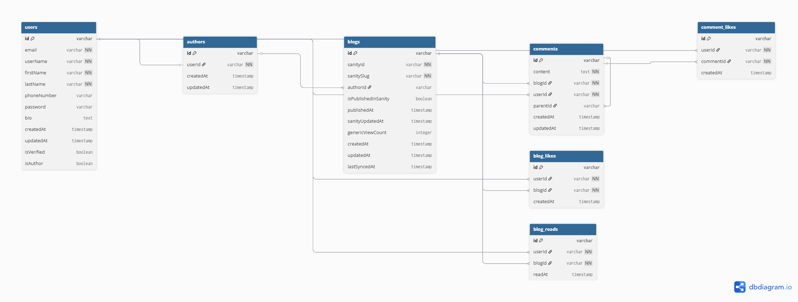

# 🚀 Production Setup & Developer Workflow


# Note if you working on this and you gonna be pushing to prod make sure to check the schema.prisma to know which database gon be working in prod!!!!

## 🏗️ High-Level Architecture Overview

This application uses a **hybrid architecture** that combines the power of Sanity CMS with local database management:

### **Database Strategy**

- **SQLite** for local development (fast, zero-config)
- **PostgreSQL** for production (scalable, robust)
- **Sanity CMS** as the source of truth for content

### **The User → Author Flow**

1. **Users** are stored entirely in our database (auth, profiles, interactions)
2. **Authors** start as regular users who apply for elevation
3. **Author approval** happens through Sanity (controlled by admins)
4. **Blog content** lives in Sanity, but we maintain local references for interactions (likes, comments, reads)

### **Why This Hybrid Approach?**

- **Sanity** handles content management, rich text, media, and editorial workflows
- **Our DB** handles user data, interactions, and real-time features that don't belong in a CMS
- **Local references** ensure fast queries for user interactions while keeping content centralized

---

## 📊 Schema Relationships


_Reference this diagram to understand the complete relationship flow in the diagram_

### **Core Models Breakdown:**

#### **User Model** 🧑‍💼

- Complete user profiles with auth data
- Optional phone/password for Google auth flexibility
- Track verification status and basic profile info
- **Relations**: Comments, Likes, Reads, and potential Author elevation

#### **Author Model** ✍️

- **One-to-one** with User (authors are elevated users)
- Local reference only - most author content comes from Sanity
- **Critical**: Authors can be suspended/deleted, hence optional blog relations

#### **Blog Model** 📝

- **Hybrid model**: References Sanity content with local interaction data
- `sanityId` and `sanitySlug` link to Sanity documents
- `authorId` is **optional** (authors can be suspended/deleted)
- Publication control synced from Sanity
- Local analytics and interaction tracking

#### **Interaction Models** 💬❤️📖

- `Comment`, `CommentLike`, `BlogLike`, `BlogRead`
- All tied to local users and local blog references
- Real-time features that complement Sanity content

---

## 🔄 Development Environment Setup

### **⚠️ CRITICAL: Two-Environment System**

We run **dual environments** to prevent production contamination:

#### **Local Development:**

- **Database**: SQLite (`dev.db`)
- **Sanity**: Development dataset
- **Purpose**: Rapid testing and feature development

#### **Production:**

- **Database**: PostgreSQL
- **Sanity**: Production dataset
- **Purpose**: Live application with real content

### **🚨 WARNING: Environment Awareness**

**FOR SANITY STUDIO, DEVELOPERS - PAY ATTENTION:**

When working in Sanity Studio, **ALWAYS** check which environment you're in:


**Look at the top left corner** and ensure you're in the correct dataset:

- `development` for local work
- `production` for live content

**Commands like `sanity deploy` and schema changes will affect all the datasets, but the data contained in each dataset is local to it!**

---

## 🛠️ Developer Workflow

### **Step 1: Understand the Sanity Schema First** 📚

Before touching any code if you are new to this :

1. **Study the Sanity schema** : look up the gofamintui-cms package, understand what is going on
2. **Review the schema diagram** (see image above)
3. **Understand the content flow**: How blog posts, authors, and categories relate
4. **Test in Sanity Studio** to see how content is created and managed

### **Step 2: Database Setup** 🗄️

#### **⚠️ NEVER drop the SQLite database accidentally!**

The local SQLite database (`dev.db`) contains:

- **Seeded user data** that matches our Sanity development content
- **Foreign key relationships** that depend on specific IDs
- **Test interactions** (comments, likes) that reference both local and Sanity data


## ⚠️ Critical Warnings & Best Practices

### **🚨 Database Warnings**

1. **DON'T delete the SQLite file** - it contains carefully crafted seed data for all the schemas at the moment, if you must drop something fully consider all relationships and consult and do the right thing
2. **DON'T run migrations without understanding dependencies** - some tables reference Sanity content
3. **DO coordinate with those in charge** before major schema changes
4. **DO use transactions** for operations that affect multiple related tables (you can see an example in my api/sanity route)

### **🚨 Sanity Warnings**

1. **ALWAYS verify your environment** before publishing content (abeg nobdoy is above mistake but ejhoor, check oo)
2. **DON'T deploy schema changes to production** without neccessary approval oooo!!!!
3. **DO test content changes in development first**
4. **DO remember that both databases reference the same Sanity content**

### **🚨 Foreign Key Relationships**

Our schema has **intentional cascading relationships**:

- **User deletion** → Cascades to all their interactions
- **Blog deletion** → Cascades to all comments and likes
- **Author suspension** → Sets blog `authorId` to null (doesn't break the app)

**Be extra careful with:**

- Deleting users who are also authors
- Removing blogs that have comments/interactions
- Testing with data that doesn't exist in both environments

---


### **Development**

```bash
npm run dev               # Start Next.js development server
npm run build             # Build for production
npm run  lint             # eslinting and ensures we don't get random vercel messages
```

---


## 🎯 Testing Guidelines

### **For Local Testing:**

1. **Use the existing seeded database** - don't recreate unless necessary
2. **Create test users** through the app, don't manipulate the database directly (don't be messing around with prisma studio)
3. **Test author workflows** in development Sanity first
4. **Verify that local interactions** (comments, likes) work with Sanity content


---

_Remember: This hybrid architecture gives us the best of both worlds - powerful content management with fast, interactive user features. Respect the boundaries between systems and you'll have a smooth development experience._
